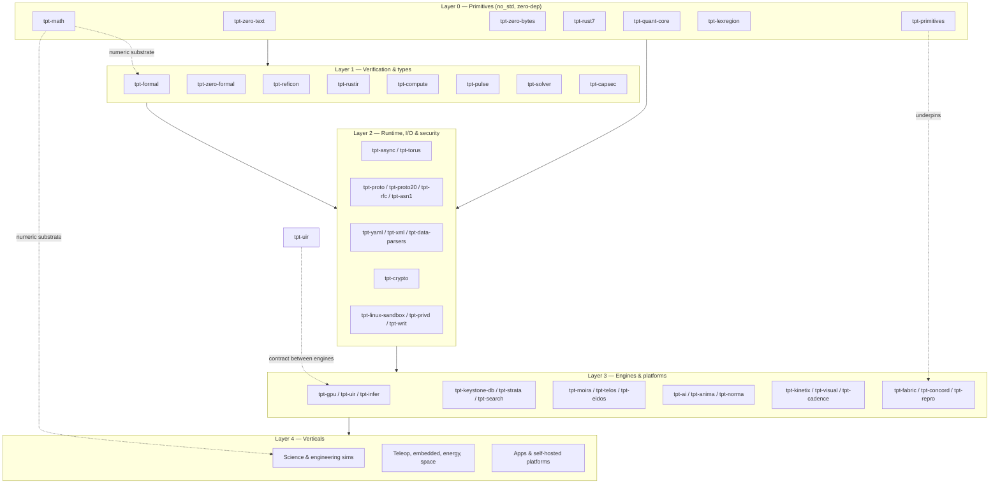

# TPT Solutions

**Memory-safe, formally-verifiable, dependency-light open-source software — mostly Rust, dual-licensed MIT / Apache-2.0.**

[Support & Discord](https://github.com/tpt-solutions/.github/blob/main/SUPPORT.md) · [Contributing](https://github.com/tpt-solutions/.github/blob/main/CONTRIBUTING.md) · [Security](https://github.com/tpt-solutions/.github/blob/main/SECURITY.md) · [support@tptsolutions.co.nz](mailto:support@tptsolutions.co.nz)

---

## Overall progress

<!-- PROGRESS:START -->
**31,396 of 39,180 tasks complete — 80.1%** `████████████████░░░░`

| Completed | Remaining | Total | Repos tracked | Repos with no `todo.md` |
|---:|---:|---:|---:|---:|
| 31,396 | 7,784 | 39,180 | 302 | 27 |

Counted from `- [x]` / `- [ ]` checkboxes in each repo's `todo.md`. Updated 2026-10-07 (UTC).

Per-repo progress

| Repo | Done | Left | Progress |
|---|---:|---:|---|
| [tpt-aletheia](https://github.com/tpt-solutions/tpt-aletheia) | 82 | 0 | `██████████` 100% |
| [tpt-astrolink](https://github.com/tpt-solutions/tpt-astrolink) | 104 | 0 | `██████████` 100% |
| [tpt-av-test](https://github.com/tpt-solutions/tpt-av-test) | 63 | 0 | `██████████` 100% |
| [tpt-boxcar](https://github.com/tpt-solutions/tpt-boxcar) | 274 | 0 | `██████████` 100% |
| [tpt-chora](https://github.com/tpt-solutions/tpt-chora) | 150 | 0 | `██████████` 100% |
| [tpt-doctor](https://github.com/tpt-solutions/tpt-doctor) | 355 | 0 | `██████████` 100% |
| [tpt-e-node](https://github.com/tpt-solutions/tpt-e-node) | 33 | 0 | `██████████` 100% |
| [tpt-eidos](https://github.com/tpt-solutions/tpt-eidos) | 90 | 0 | `██████████` 100% |
| [tpt-email-provider](https://github.com/tpt-solutions/tpt-email-provider) | 182 | 0 | `██████████` 100% |
| [tpt-embedded-core](https://github.com/tpt-solutions/tpt-embedded-core) | 164 | 0 | `██████████` 100% |
| [tpt-erp-rust](https://github.com/tpt-solutions/tpt-erp-rust) | 172 | 0 | `██████████` 100% |
| [tpt-focus](https://github.com/tpt-solutions/tpt-focus) | 58 | 0 | `██████████` 100% |
| [tpt-library](https://github.com/tpt-solutions/tpt-library) | 378 | 0 | `██████████` 100% |
| [tpt-locus](https://github.com/tpt-solutions/tpt-locus) | 66 | 0 | `██████████` 100% |
| [tpt-math](https://github.com/tpt-solutions/tpt-math) | 410 | 0 | `██████████` 100% |
| [tpt-physics](https://github.com/tpt-solutions/tpt-physics) | 123 | 0 | `██████████` 100% |
| [tpt-police](https://github.com/tpt-solutions/tpt-police) | 251 | 0 | `██████████` 100% |
| [tpt-portcullis](https://github.com/tpt-solutions/tpt-portcullis) | 55 | 0 | `██████████` 100% |
| [tpt-primitives](https://github.com/tpt-solutions/tpt-primitives) | 65 | 0 | `██████████` 100% |
| [tpt-pwa](https://github.com/tpt-solutions/tpt-pwa) | 115 | 0 | `██████████` 100% |
| [tpt-repro](https://github.com/tpt-solutions/tpt-repro) | 99 | 0 | `██████████` 100% |
| [tpt-res](https://github.com/tpt-solutions/tpt-res) | 163 | 0 | `██████████` 100% |
| [tpt-robotics](https://github.com/tpt-solutions/tpt-robotics) | 98 | 0 | `██████████` 100% |
| [tpt-rust3](https://github.com/tpt-solutions/tpt-rust3) | 72 | 0 | `██████████` 100% |
| [tpt-school](https://github.com/tpt-solutions/tpt-school) | 31 | 0 | `██████████` 100% |
| [tpt-science](https://github.com/tpt-solutions/tpt-science) | 168 | 0 | `██████████` 100% |
| [tpt-security-test](https://github.com/tpt-solutions/tpt-security-test) | 76 | 0 | `██████████` 100% |
| [tpt-shipyard](https://github.com/tpt-solutions/tpt-shipyard) | 311 | 0 | `██████████` 100% |
| [tpt-smartcity](https://github.com/tpt-solutions/tpt-smartcity) | 54 | 0 | `██████████` 100% |
| [tpt-system-zero](https://github.com/tpt-solutions/tpt-system-zero) | 98 | 0 | `██████████` 100% |
| [tpt-telemetry](https://github.com/tpt-solutions/tpt-telemetry) | 110 | 0 | `██████████` 100% |
| [tpt-teleop](https://github.com/tpt-solutions/tpt-teleop) | 159 | 0 | `██████████` 100% |
| [tpt-teleop-space](https://github.com/tpt-solutions/tpt-teleop-space) | 123 | 0 | `██████████` 100% |
| [tpt-titan](https://github.com/tpt-solutions/tpt-titan) | 68 | 0 | `██████████` 100% |
| [tpt-water](https://github.com/tpt-solutions/tpt-water) | 152 | 0 | `██████████` 100% |
| [tpt-water-utility](https://github.com/tpt-solutions/tpt-water-utility) | 35 | 0 | `██████████` 100% |
| [tpt-proto](https://github.com/tpt-solutions/tpt-proto) | 299 | 1 | `██████████` 100% |
| [tpt-free-erp](https://github.com/tpt-solutions/tpt-free-erp) | 444 | 2 | `██████████` 100% |
| [tpt-biosig](https://github.com/tpt-solutions/tpt-biosig) | 202 | 1 | `██████████` 100% |
| [tpt-uir](https://github.com/tpt-solutions/tpt-uir) | 160 | 1 | `██████████` 99% |
| [tpt-cerebrum](https://github.com/tpt-solutions/tpt-cerebrum) | 152 | 1 | `██████████` 99% |
| [tpt-scheduler](https://github.com/tpt-solutions/tpt-scheduler) | 129 | 1 | `██████████` 99% |
| [tpt-concord](https://github.com/tpt-solutions/tpt-concord) | 115 | 1 | `██████████` 99% |
| [tpt-electronics](https://github.com/tpt-solutions/tpt-electronics) | 336 | 3 | `██████████` 99% |
| [tpt-streamforge](https://github.com/tpt-solutions/tpt-streamforge) | 224 | 2 | `██████████` 99% |
| [tpt-cadence](https://github.com/tpt-solutions/tpt-cadence) | 111 | 1 | `██████████` 99% |
| [tpt-court](https://github.com/tpt-solutions/tpt-court) | 106 | 1 | `██████████` 99% |
| [tpt-selenograph](https://github.com/tpt-solutions/tpt-selenograph) | 86 | 1 | `██████████` 99% |
| [tpt-zero-formal](https://github.com/tpt-solutions/tpt-zero-formal) | 172 | 2 | `██████████` 99% |
| [tpt-gatemesh](https://github.com/tpt-solutions/tpt-gatemesh) | 83 | 1 | `██████████` 99% |
| [tpt-transportation](https://github.com/tpt-solutions/tpt-transportation) | 246 | 3 | `██████████` 99% |
| [tpt-axiom](https://github.com/tpt-solutions/tpt-axiom) | 163 | 2 | `██████████` 99% |
| [tpt-av-ui](https://github.com/tpt-solutions/tpt-av-ui) | 77 | 1 | `██████████` 99% |
| [tpt-gov-nz](https://github.com/tpt-solutions/tpt-gov-nz) | 378 | 5 | `██████████` 99% |
| [tpt-kinetix](https://github.com/tpt-solutions/tpt-kinetix) | 140 | 2 | `██████████` 99% |
| [tpt-lexregion](https://github.com/tpt-solutions/tpt-lexregion) | 68 | 1 | `██████████` 99% |
| [tpt-zero-bytes](https://github.com/tpt-solutions/tpt-zero-bytes) | 68 | 1 | `██████████` 99% |
| [tpt-keystone-db](https://github.com/tpt-solutions/tpt-keystone-db) | 67 | 1 | `██████████` 99% |
| [tpt-nexus](https://github.com/tpt-solutions/tpt-nexus) | 133 | 2 | `██████████` 99% |
| [tpt-relay](https://github.com/tpt-solutions/tpt-relay) | 62 | 1 | `██████████` 98% |
| [tpt-barcode](https://github.com/tpt-solutions/tpt-barcode) | 116 | 2 | `██████████` 98% |
| [tpt-fathom](https://github.com/tpt-solutions/tpt-fathom) | 113 | 2 | `██████████` 98% |
| [tpt-infer](https://github.com/tpt-solutions/tpt-infer) | 110 | 2 | `██████████` 98% |
| [tpt-solver](https://github.com/tpt-solutions/tpt-solver) | 55 | 1 | `██████████` 98% |
| [tpt-anvil](https://github.com/tpt-solutions/tpt-anvil) | 270 | 5 | `██████████` 98% |
| [tpt-materials](https://github.com/tpt-solutions/tpt-materials) | 266 | 5 | `██████████` 98% |
| [tpt-bluetooth-mesh](https://github.com/tpt-solutions/tpt-bluetooth-mesh) | 106 | 2 | `██████████` 98% |
| [tpt-visual](https://github.com/tpt-solutions/tpt-visual) | 155 | 3 | `██████████` 98% |
| [tpt-nova](https://github.com/tpt-solutions/tpt-nova) | 149 | 3 | `██████████` 98% |
| [tpt-privd](https://github.com/tpt-solutions/tpt-privd) | 99 | 2 | `██████████` 98% |
| [tpt-teleop-fleet](https://github.com/tpt-solutions/tpt-teleop-fleet) | 48 | 1 | `██████████` 98% |
| [tpt-linux-hw](https://github.com/tpt-solutions/tpt-linux-hw) | 93 | 2 | `██████████` 98% |
| [tpt-netmon](https://github.com/tpt-solutions/tpt-netmon) | 86 | 2 | `██████████` 98% |
| [tpt-av-control](https://github.com/tpt-solutions/tpt-av-control) | 123 | 3 | `██████████` 98% |
| [tpt-data-parsers](https://github.com/tpt-solutions/tpt-data-parsers) | 238 | 6 | `██████████` 98% |
| [tpt-torus](https://github.com/tpt-solutions/tpt-torus) | 118 | 3 | `██████████` 98% |
| [tpt-workflow](https://github.com/tpt-solutions/tpt-workflow) | 39 | 1 | `██████████` 98% |
| [tpt-validex](https://github.com/tpt-solutions/tpt-validex) | 194 | 5 | `██████████` 97% |
| [tpt-vertex](https://github.com/tpt-solutions/tpt-vertex) | 225 | 6 | `██████████` 97% |
| [tpt-dx-testing](https://github.com/tpt-solutions/tpt-dx-testing) | 112 | 3 | `██████████` 97% |
| [tpt-perception](https://github.com/tpt-solutions/tpt-perception) | 74 | 2 | `██████████` 97% |
| [tpt-process](https://github.com/tpt-solutions/tpt-process) | 110 | 3 | `██████████` 97% |
| [tpt-fluids](https://github.com/tpt-solutions/tpt-fluids) | 108 | 3 | `██████████` 97% |
| [tpt-writ](https://github.com/tpt-solutions/tpt-writ) | 36 | 1 | `██████████` 97% |
| [tpt-rust1](https://github.com/tpt-solutions/tpt-rust1) | 171 | 5 | `██████████` 97% |
| [tpt-fem](https://github.com/tpt-solutions/tpt-fem) | 270 | 8 | `██████████` 97% |
| [tpt-gpu](https://github.com/tpt-solutions/tpt-gpu) | 302 | 9 | `██████████` 97% |
| [tpt-linux-sandbox](https://github.com/tpt-solutions/tpt-linux-sandbox) | 67 | 2 | `██████████` 97% |
| [tpt-accessfix](https://github.com/tpt-solutions/tpt-accessfix) | 227 | 7 | `██████████` 97% |
| [tpt-vitalis](https://github.com/tpt-solutions/tpt-vitalis) | 193 | 6 | `██████████` 97% |
| [tpt-anima](https://github.com/tpt-solutions/tpt-anima) | 254 | 8 | `██████████` 97% |
| [tpt-ai-agents](https://github.com/tpt-solutions/tpt-ai-agents) | 94 | 3 | `██████████` 97% |
| [tpt-energy](https://github.com/tpt-solutions/tpt-energy) | 232 | 8 | `██████████` 97% |
| [tpt-openledger](https://github.com/tpt-solutions/tpt-openledger) | 143 | 5 | `██████████` 97% |
| [tpt-appfront](https://github.com/tpt-solutions/tpt-appfront) | 160 | 6 | `██████████` 96% |
| [tpt-io-standards](https://github.com/tpt-solutions/tpt-io-standards) | 211 | 8 | `██████████` 96% |
| [tpt-spark](https://github.com/tpt-solutions/tpt-spark) | 51 | 2 | `██████████` 96% |
| [tpt-citadel](https://github.com/tpt-solutions/tpt-citadel) | 100 | 4 | `██████████` 96% |
| [tpt-audio](https://github.com/tpt-solutions/tpt-audio) | 73 | 3 | `██████████` 96% |
| [tpt-yaml](https://github.com/tpt-solutions/tpt-yaml) | 97 | 4 | `██████████` 96% |
| [tpt-dev-dx](https://github.com/tpt-solutions/tpt-dev-dx) | 142 | 6 | `██████████` 96% |
| [tpt-datastack-nz](https://github.com/tpt-solutions/tpt-datastack-nz) | 118 | 5 | `██████████` 96% |
| [tpt-glyph](https://github.com/tpt-solutions/tpt-glyph) | 116 | 5 | `██████████` 96% |
| [tpt-control](https://github.com/tpt-solutions/tpt-control) | 46 | 2 | `██████████` 96% |
| [tpt-dsp](https://github.com/tpt-solutions/tpt-dsp) | 114 | 5 | `██████████` 96% |
| [tpt-proto20](https://github.com/tpt-solutions/tpt-proto20) | 498 | 22 | `██████████` 96% |
| [tpt-aura](https://github.com/tpt-solutions/tpt-aura) | 90 | 4 | `██████████` 96% |
| [tpt-eve](https://github.com/tpt-solutions/tpt-eve) | 112 | 5 | `██████████` 96% |
| [tpt-archon](https://github.com/tpt-solutions/tpt-archon) | 201 | 9 | `██████████` 96% |
| [tpt-teleop-agri](https://github.com/tpt-solutions/tpt-teleop-agri) | 89 | 4 | `██████████` 96% |
| [tpt-identity](https://github.com/tpt-solutions/tpt-identity) | 88 | 4 | `██████████` 96% |
| [tpt-substrate](https://github.com/tpt-solutions/tpt-substrate) | 43 | 2 | `██████████` 96% |
| [tpt-lattice](https://github.com/tpt-solutions/tpt-lattice) | 149 | 7 | `██████████` 96% |
| [tpt-av-sync](https://github.com/tpt-solutions/tpt-av-sync) | 165 | 8 | `██████████` 95% |
| [tpt-e-link](https://github.com/tpt-solutions/tpt-e-link) | 41 | 2 | `██████████` 95% |
| [tpt-av-asset](https://github.com/tpt-solutions/tpt-av-asset) | 101 | 5 | `██████████` 95% |
| [tpt-deb-toolkit](https://github.com/tpt-solutions/tpt-deb-toolkit) | 161 | 8 | `██████████` 95% |
| [tpt-fulcrum](https://github.com/tpt-solutions/tpt-fulcrum) | 79 | 4 | `██████████` 95% |
| [tpt-bastion](https://github.com/tpt-solutions/tpt-bastion) | 59 | 3 | `██████████` 95% |
| [tpt-teleop-construction](https://github.com/tpt-solutions/tpt-teleop-construction) | 98 | 5 | `██████████` 95% |
| [tpt-crypto](https://github.com/tpt-solutions/tpt-crypto) | 112 | 6 | `█████████░` 95% |
| [tpt-meridian](https://github.com/tpt-solutions/tpt-meridian) | 111 | 6 | `█████████░` 95% |
| [tpt-power](https://github.com/tpt-solutions/tpt-power) | 166 | 9 | `█████████░` 95% |
| [tpt-banking](https://github.com/tpt-solutions/tpt-banking) | 147 | 8 | `█████████░` 95% |
| [tpt-multibody-dynamics](https://github.com/tpt-solutions/tpt-multibody-dynamics) | 147 | 8 | `█████████░` 95% |
| [tpt-cv](https://github.com/tpt-solutions/tpt-cv) | 143 | 8 | `█████████░` 95% |
| [tpt-linux2026](https://github.com/tpt-solutions/tpt-linux2026) | 138 | 8 | `█████████░` 95% |
| [tpt-local-ai](https://github.com/tpt-solutions/tpt-local-ai) | 138 | 8 | `█████████░` 95% |
| [tpt-pdf](https://github.com/tpt-solutions/tpt-pdf) | 155 | 9 | `█████████░` 95% |
| [tpt-foundryos](https://github.com/tpt-solutions/tpt-foundryos) | 102 | 6 | `█████████░` 94% |
| [tpt-strata](https://github.com/tpt-solutions/tpt-strata) | 83 | 5 | `█████████░` 94% |
| [tpt-chrysalis](https://github.com/tpt-solutions/tpt-chrysalis) | 82 | 5 | `█████████░` 94% |
| [tpt-silicon](https://github.com/tpt-solutions/tpt-silicon) | 82 | 5 | `█████████░` 94% |
| [tpt-rust6](https://github.com/tpt-solutions/tpt-rust6) | 130 | 8 | `█████████░` 94% |
| [tpt-tektos](https://github.com/tpt-solutions/tpt-tektos) | 65 | 4 | `█████████░` 94% |
| [tpt-xml](https://github.com/tpt-solutions/tpt-xml) | 78 | 5 | `█████████░` 94% |
| [tpt-formal-lab](https://github.com/tpt-solutions/tpt-formal-lab) | 153 | 10 | `█████████░` 94% |
| [tpt-crucible-py](https://github.com/tpt-solutions/tpt-crucible-py) | 580 | 38 | `█████████░` 94% |
| [tpt-intellect](https://github.com/tpt-solutions/tpt-intellect) | 212 | 14 | `█████████░` 94% |
| [tpt-swarm](https://github.com/tpt-solutions/tpt-swarm) | 121 | 8 | `█████████░` 94% |
| [tpt-hiveforge](https://github.com/tpt-solutions/tpt-hiveforge) | 140 | 10 | `█████████░` 93% |
| [tpt-syntaxis](https://github.com/tpt-solutions/tpt-syntaxis) | 28 | 2 | `█████████░` 93% |
| [tpt-zero-text](https://github.com/tpt-solutions/tpt-zero-text) | 377 | 28 | `█████████░` 93% |
| [tpt-beacon](https://github.com/tpt-solutions/tpt-beacon) | 104 | 8 | `█████████░` 93% |
| [tpt-kv-quant](https://github.com/tpt-solutions/tpt-kv-quant) | 48 | 4 | `█████████░` 92% |
| [tpt-fab](https://github.com/tpt-solutions/tpt-fab) | 45 | 4 | `█████████░` 92% |
| [tpt-net-async](https://github.com/tpt-solutions/tpt-net-async) | 45 | 4 | `█████████░` 92% |
| [tpt-production](https://github.com/tpt-solutions/tpt-production) | 156 | 14 | `█████████░` 92% |
| [tpt-async](https://github.com/tpt-solutions/tpt-async) | 132 | 12 | `█████████░` 92% |
| [tpt-rustir](https://github.com/tpt-solutions/tpt-rustir) | 77 | 7 | `█████████░` 92% |
| [tpt-rust2](https://github.com/tpt-solutions/tpt-rust2) | 43 | 4 | `█████████░` 91% |
| [tpt-formal](https://github.com/tpt-solutions/tpt-formal) | 126 | 12 | `█████████░` 91% |
| [tpt-koinon](https://github.com/tpt-solutions/tpt-koinon) | 132 | 13 | `█████████░` 91% |
| [tpt-voice](https://github.com/tpt-solutions/tpt-voice) | 80 | 8 | `█████████░` 91% |
| [tpt-strategygraph](https://github.com/tpt-solutions/tpt-strategygraph) | 118 | 12 | `█████████░` 91% |
| [tpt-construction](https://github.com/tpt-solutions/tpt-construction) | 176 | 18 | `█████████░` 91% |
| [tpt-biocad](https://github.com/tpt-solutions/tpt-biocad) | 58 | 6 | `█████████░` 91% |
| [tpt-equinox](https://github.com/tpt-solutions/tpt-equinox) | 48 | 5 | `█████████░` 91% |
| [tpt-explorer](https://github.com/tpt-solutions/tpt-explorer) | 86 | 9 | `█████████░` 91% |
| [tpt-email](https://github.com/tpt-solutions/tpt-email) | 179 | 19 | `█████████░` 90% |
| [tpt-synapse](https://github.com/tpt-solutions/tpt-synapse) | 47 | 5 | `█████████░` 90% |
| [tpt-basestation](https://github.com/tpt-solutions/tpt-basestation) | 111 | 12 | `█████████░` 90% |
| [tpt-telos](https://github.com/tpt-solutions/tpt-telos) | 129 | 14 | `█████████░` 90% |
| [tpt-armature](https://github.com/tpt-solutions/tpt-armature) | 110 | 12 | `█████████░` 90% |
| [tpt-stratum](https://github.com/tpt-solutions/tpt-stratum) | 119 | 13 | `█████████░` 90% |
| [tpt-protocol](https://github.com/tpt-solutions/tpt-protocol) | 91 | 10 | `█████████░` 90% |
| [tpt-engineering](https://github.com/tpt-solutions/tpt-engineering) | 145 | 16 | `█████████░` 90% |
| [tpt-gis](https://github.com/tpt-solutions/tpt-gis) | 122 | 14 | `█████████░` 90% |
| [tpt-agriculture](https://github.com/tpt-solutions/tpt-agriculture) | 155 | 18 | `█████████░` 90% |
| [tpt-code-command-center](https://github.com/tpt-solutions/tpt-code-command-center) | 60 | 7 | `█████████░` 90% |
| [tpt-argus](https://github.com/tpt-solutions/tpt-argus) | 126 | 15 | `█████████░` 89% |
| [tpt-dynamo](https://github.com/tpt-solutions/tpt-dynamo) | 50 | 6 | `█████████░` 89% |
| [tpt-chassis](https://github.com/tpt-solutions/tpt-chassis) | 66 | 8 | `█████████░` 89% |
| [tpt-datacenter](https://github.com/tpt-solutions/tpt-datacenter) | 99 | 12 | `█████████░` 89% |
| [tpt-flight-control](https://github.com/tpt-solutions/tpt-flight-control) | 98 | 12 | `█████████░` 89% |
| [tpt-law](https://github.com/tpt-solutions/tpt-law) | 79 | 10 | `█████████░` 89% |
| [tpt-embedded-tools](https://github.com/tpt-solutions/tpt-embedded-tools) | 155 | 20 | `█████████░` 89% |
| [tpt-fabric](https://github.com/tpt-solutions/tpt-fabric) | 131 | 17 | `█████████░` 89% |
| [tpt-cortex](https://github.com/tpt-solutions/tpt-cortex) | 100 | 13 | `█████████░` 88% |
| [tpt-medical](https://github.com/tpt-solutions/tpt-medical) | 160 | 21 | `█████████░` 88% |
| [tpt-odyssey](https://github.com/tpt-solutions/tpt-odyssey) | 51 | 7 | `█████████░` 88% |
| [tpt-healthcare-nz](https://github.com/tpt-solutions/tpt-healthcare-nz) | 106 | 15 | `█████████░` 88% |
| [tpt-weave](https://github.com/tpt-solutions/tpt-weave) | 279 | 40 | `█████████░` 87% |
| [tpt-electromagnetics](https://github.com/tpt-solutions/tpt-electromagnetics) | 110 | 16 | `█████████░` 87% |
| [tpt-abyss](https://github.com/tpt-solutions/tpt-abyss) | 67 | 10 | `█████████░` 87% |
| [tpt-buildsmart](https://github.com/tpt-solutions/tpt-buildsmart) | 99 | 15 | `█████████░` 87% |
| [tpt-rust4](https://github.com/tpt-solutions/tpt-rust4) | 83 | 13 | `█████████░` 86% |
| [tpt-terminal-ui](https://github.com/tpt-solutions/tpt-terminal-ui) | 76 | 12 | `█████████░` 86% |
| [tpt-soma](https://github.com/tpt-solutions/tpt-soma) | 107 | 17 | `█████████░` 86% |
| [tpt-capsec](https://github.com/tpt-solutions/tpt-capsec) | 98 | 16 | `█████████░` 86% |
| [tpt-cli](https://github.com/tpt-solutions/tpt-cli) | 49 | 8 | `█████████░` 86% |
| [tpt-netctl](https://github.com/tpt-solutions/tpt-netctl) | 48 | 8 | `█████████░` 86% |
| [tpt-zenith](https://github.com/tpt-solutions/tpt-zenith) | 36 | 6 | `█████████░` 86% |
| [tpt-systems-optimisation](https://github.com/tpt-solutions/tpt-systems-optimisation) | 306 | 53 | `█████████░` 85% |
| [tpt-thermodynamics](https://github.com/tpt-solutions/tpt-thermodynamics) | 143 | 25 | `█████████░` 85% |
| [tpt-spectrumos](https://github.com/tpt-solutions/tpt-spectrumos) | 86 | 16 | `████████░░` 84% |
| [tpt-flow](https://github.com/tpt-solutions/tpt-flow) | 112 | 21 | `████████░░` 84% |
| [tpt-construct](https://github.com/tpt-solutions/tpt-construct) | 69 | 13 | `████████░░` 84% |
| [tpt-conduit](https://github.com/tpt-solutions/tpt-conduit) | 42 | 8 | `████████░░` 84% |
| [tpt-rust7](https://github.com/tpt-solutions/tpt-rust7) | 35 | 7 | `████████░░` 83% |
| [tpt-farmer](https://github.com/tpt-solutions/tpt-farmer) | 39 | 8 | `████████░░` 83% |
| [tpt-asn1](https://github.com/tpt-solutions/tpt-asn1) | 95 | 20 | `████████░░` 83% |
| [tpt-diskview](https://github.com/tpt-solutions/tpt-diskview) | 42 | 9 | `████████░░` 82% |
| [tpt-raglite](https://github.com/tpt-solutions/tpt-raglite) | 79 | 17 | `████████░░` 82% |
| [tpt-av](https://github.com/tpt-solutions/tpt-av) | 81 | 19 | `████████░░` 81% |
| [tpt-aegis](https://github.com/tpt-solutions/tpt-aegis) | 105 | 25 | `████████░░` 81% |
| [tpt-ate](https://github.com/tpt-solutions/tpt-ate) | 25 | 6 | `████████░░` 81% |
| [tpt-crucible](https://github.com/tpt-solutions/tpt-crucible) | 86 | 21 | `████████░░` 80% |
| [tpt-oikos](https://github.com/tpt-solutions/tpt-oikos) | 45 | 11 | `████████░░` 80% |
| [tpt-pattern](https://github.com/tpt-solutions/tpt-pattern) | 49 | 12 | `████████░░` 80% |
| [tpt-vanguard](https://github.com/tpt-solutions/tpt-vanguard) | 65 | 16 | `████████░░` 80% |
| [tpt-clipboard](https://github.com/tpt-solutions/tpt-clipboard) | 20 | 5 | `████████░░` 80% |
| [tpt-astrobus](https://github.com/tpt-solutions/tpt-astrobus) | 82 | 21 | `████████░░` 80% |
| [tpt-online-video](https://github.com/tpt-solutions/tpt-online-video) | 690 | 184 | `████████░░` 79% |
| [tpt-quant-core](https://github.com/tpt-solutions/tpt-quant-core) | 41 | 11 | `████████░░` 79% |
| [tpt-aion](https://github.com/tpt-solutions/tpt-aion) | 33 | 9 | `████████░░` 79% |
| [tpt-thermal](https://github.com/tpt-solutions/tpt-thermal) | 71 | 20 | `████████░░` 78% |
| [tpt-servo](https://github.com/tpt-solutions/tpt-servo) | 35 | 10 | `████████░░` 78% |
| [tpt-finder](https://github.com/tpt-solutions/tpt-finder) | 73 | 21 | `████████░░` 78% |
| [tpt-lexicon](https://github.com/tpt-solutions/tpt-lexicon) | 72 | 21 | `████████░░` 77% |
| [tpt-neuron](https://github.com/tpt-solutions/tpt-neuron) | 48 | 14 | `████████░░` 77% |
| [tpt-e-wasm](https://github.com/tpt-solutions/tpt-e-wasm) | 47 | 14 | `████████░░` 77% |
| [tpt-runtime](https://github.com/tpt-solutions/tpt-runtime) | 97 | 29 | `████████░░` 77% |
| [tpt-mesh](https://github.com/tpt-solutions/tpt-mesh) | 199 | 60 | `████████░░` 77% |
| [tpt-cambium](https://github.com/tpt-solutions/tpt-cambium) | 59 | 18 | `████████░░` 77% |
| [tpt-cobalt](https://github.com/tpt-solutions/tpt-cobalt) | 108 | 33 | `████████░░` 77% |
| [tpt-gameforge](https://github.com/tpt-solutions/tpt-gameforge) | 75 | 23 | `████████░░` 77% |
| [tpt-helm](https://github.com/tpt-solutions/tpt-helm) | 48 | 15 | `████████░░` 76% |
| [tpt-q-phase](https://github.com/tpt-solutions/tpt-q-phase) | 38 | 13 | `███████░░░` 75% |
| [tpt-microlog](https://github.com/tpt-solutions/tpt-microlog) | 117 | 41 | `███████░░░` 74% |
| [tpt-doc](https://github.com/tpt-solutions/tpt-doc) | 122 | 46 | `███████░░░` 73% |
| [tpt-wasmforge](https://github.com/tpt-solutions/tpt-wasmforge) | 50 | 19 | `███████░░░` 72% |
| [tpt-wasm](https://github.com/tpt-solutions/tpt-wasm) | 132 | 51 | `███████░░░` 72% |
| [tpt-moira](https://github.com/tpt-solutions/tpt-moira) | 95 | 40 | `███████░░░` 70% |
| [tpt-rfc](https://github.com/tpt-solutions/tpt-rfc) | 242 | 106 | `███████░░░` 70% |
| [tpt-sensetel](https://github.com/tpt-solutions/tpt-sensetel) | 35 | 17 | `███████░░░` 67% |
| [tpt-virtual](https://github.com/tpt-solutions/tpt-virtual) | 99 | 50 | `███████░░░` 66% |
| [tpt-gitcastle](https://github.com/tpt-solutions/tpt-gitcastle) | 38 | 20 | `███████░░░` 66% |
| [tpt-reficon](https://github.com/tpt-solutions/tpt-reficon) | 40 | 22 | `██████░░░░` 65% |
| [tpt-helix](https://github.com/tpt-solutions/tpt-helix) | 85 | 47 | `██████░░░░` 64% |
| [tpt-building-designer](https://github.com/tpt-solutions/tpt-building-designer) | 32 | 18 | `██████░░░░` 64% |
| [tpt-ignis](https://github.com/tpt-solutions/tpt-ignis) | 22 | 13 | `██████░░░░` 63% |
| [tpt-chemistry](https://github.com/tpt-solutions/tpt-chemistry) | 124 | 75 | `██████░░░░` 62% |
| [tpt-warden](https://github.com/tpt-solutions/tpt-warden) | 41 | 25 | `██████░░░░` 62% |
| [tpt-webrtc](https://github.com/tpt-solutions/tpt-webrtc) | 111 | 69 | `██████░░░░` 62% |
| [tpt-simd](https://github.com/tpt-solutions/tpt-simd) | 192 | 126 | `██████░░░░` 60% |
| [tpt-morph](https://github.com/tpt-solutions/tpt-morph) | 35 | 24 | `██████░░░░` 59% |
| [tpt-mathica](https://github.com/tpt-solutions/tpt-mathica) | 21 | 17 | `██████░░░░` 55% |
| [tpt-mosaic](https://github.com/tpt-solutions/tpt-mosaic) | 62 | 55 | `█████░░░░░` 53% |
| [tpt-compute](https://github.com/tpt-solutions/tpt-compute) | 28 | 29 | `█████░░░░░` 49% |
| [tpt-certus](https://github.com/tpt-solutions/tpt-certus) | 35 | 38 | `█████░░░░░` 48% |
| [tpt-profiler](https://github.com/tpt-solutions/tpt-profiler) | 161 | 184 | `█████░░░░░` 47% |
| [tpt-pantheon](https://github.com/tpt-solutions/tpt-pantheon) | 23 | 30 | `████░░░░░░` 43% |
| [tpt-augur](https://github.com/tpt-solutions/tpt-augur) | 57 | 75 | `████░░░░░░` 43% |
| [tpt-hearth](https://github.com/tpt-solutions/tpt-hearth) | 92 | 144 | `████░░░░░░` 39% |
| [tpt-power-utility](https://github.com/tpt-solutions/tpt-power-utility) | 105 | 183 | `████░░░░░░` 36% |
| [tpt-env](https://github.com/tpt-solutions/tpt-env) | 31 | 57 | `████░░░░░░` 35% |
| [tpt-mcpbox](https://github.com/tpt-solutions/tpt-mcpbox) | 31 | 92 | `███░░░░░░░` 25% |
| [tpt-mathr](https://github.com/tpt-solutions/tpt-mathr) | 43 | 129 | `██░░░░░░░░` 25% |
| [tpt-hyle](https://github.com/tpt-solutions/tpt-hyle) | 8 | 67 | `█░░░░░░░░░` 11% |
| [tpt-ms-vs](https://github.com/tpt-solutions/tpt-ms-vs) | 5 | 92 | `█░░░░░░░░░` 5% |
| [tpt-senses](https://github.com/tpt-solutions/tpt-senses) | 8 | 152 | `░░░░░░░░░░` 5% |
| [tpt-conductor](https://github.com/tpt-solutions/tpt-conductor) | 2 | 56 | `░░░░░░░░░░` 3% |
| [tpt-wslx](https://github.com/tpt-solutions/tpt-wslx) | 1 | 80 | `░░░░░░░░░░` 1% |
| [tpt-acoustics](https://github.com/tpt-solutions/tpt-acoustics) | 0 | 81 | `░░░░░░░░░░` 0% |
| [tpt-actuarial](https://github.com/tpt-solutions/tpt-actuarial) | 0 | 109 | `░░░░░░░░░░` 0% |
| [tpt-aero](https://github.com/tpt-solutions/tpt-aero) | 0 | 83 | `░░░░░░░░░░` 0% |
| [tpt-aether](https://github.com/tpt-solutions/tpt-aether) | 0 | 57 | `░░░░░░░░░░` 0% |
| [tpt-ai](https://github.com/tpt-solutions/tpt-ai) | 0 | 144 | `░░░░░░░░░░` 0% |
| [tpt-cargo-vitals](https://github.com/tpt-solutions/tpt-cargo-vitals) | 0 | 43 | `░░░░░░░░░░` 0% |
| [tpt-cloud-observability](https://github.com/tpt-solutions/tpt-cloud-observability) | 0 | 63 | `░░░░░░░░░░` 0% |
| [tpt-convoy](https://github.com/tpt-solutions/tpt-convoy) | 0 | 32 | `░░░░░░░░░░` 0% |
| [tpt-des](https://github.com/tpt-solutions/tpt-des) | 0 | 58 | `░░░░░░░░░░` 0% |
| [tpt-dir](https://github.com/tpt-solutions/tpt-dir) | 0 | 86 | `░░░░░░░░░░` 0% |
| [tpt-fonts](https://github.com/tpt-solutions/tpt-fonts) | 0 | 92 | `░░░░░░░░░░` 0% |
| [tpt-glide](https://github.com/tpt-solutions/tpt-glide) | 0 | 59 | `░░░░░░░░░░` 0% |
| [tpt-homestack](https://github.com/tpt-solutions/tpt-homestack) | 0 | 140 | `░░░░░░░░░░` 0% |
| [tpt-ichnos](https://github.com/tpt-solutions/tpt-ichnos) | 0 | 61 | `░░░░░░░░░░` 0% |
| [tpt-l-riscv](https://github.com/tpt-solutions/tpt-l-riscv) | 0 | 130 | `░░░░░░░░░░` 0% |
| [tpt-macro](https://github.com/tpt-solutions/tpt-macro) | 0 | 53 | `░░░░░░░░░░` 0% |
| [tpt-methuselah](https://github.com/tpt-solutions/tpt-methuselah) | 0 | 75 | `░░░░░░░░░░` 0% |
| [tpt-monitor](https://github.com/tpt-solutions/tpt-monitor) | 0 | 94 | `░░░░░░░░░░` 0% |
| [tpt-netguard](https://github.com/tpt-solutions/tpt-netguard) | 0 | 98 | `░░░░░░░░░░` 0% |
| [tpt-norma](https://github.com/tpt-solutions/tpt-norma) | 0 | 58 | `░░░░░░░░░░` 0% |
| [tpt-optics](https://github.com/tpt-solutions/tpt-optics) | 0 | 193 | `░░░░░░░░░░` 0% |
| [tpt-portus](https://github.com/tpt-solutions/tpt-portus) | 0 | 70 | `░░░░░░░░░░` 0% |
| [tpt-pulse](https://github.com/tpt-solutions/tpt-pulse) | 0 | 61 | `░░░░░░░░░░` 0% |
| [tpt-purge](https://github.com/tpt-solutions/tpt-purge) | 0 | 77 | `░░░░░░░░░░` 0% |
| [tpt-search](https://github.com/tpt-solutions/tpt-search) | 0 | 180 | `░░░░░░░░░░` 0% |
| [tpt-semadiff](https://github.com/tpt-solutions/tpt-semadiff) | 0 | 59 | `░░░░░░░░░░` 0% |
| [tpt-shatter](https://github.com/tpt-solutions/tpt-shatter) | 0 | 210 | `░░░░░░░░░░` 0% |
| [tpt-startup](https://github.com/tpt-solutions/tpt-startup) | 0 | 78 | `░░░░░░░░░░` 0% |
| [tpt-statera](https://github.com/tpt-solutions/tpt-statera) | 0 | 74 | `░░░░░░░░░░` 0% |
| [tpt-sync](https://github.com/tpt-solutions/tpt-sync) | 0 | 98 | `░░░░░░░░░░` 0% |
| [tpt-teleop-inspection](https://github.com/tpt-solutions/tpt-teleop-inspection) | 0 | 102 | `░░░░░░░░░░` 0% |
| [tpt-teleop-medical](https://github.com/tpt-solutions/tpt-teleop-medical) | 0 | 42 | `░░░░░░░░░░` 0% |
| [tpt-teleop-urban](https://github.com/tpt-solutions/tpt-teleop-urban) | 0 | 125 | `░░░░░░░░░░` 0% |
| [tpt-thought](https://github.com/tpt-solutions/tpt-thought) | 0 | 250 | `░░░░░░░░░░` 0% |
| [tpt-vault](https://github.com/tpt-solutions/tpt-vault) | 0 | 88 | `░░░░░░░░░░` 0% |
| [tpt-view](https://github.com/tpt-solutions/tpt-view) | 0 | 106 | `░░░░░░░░░░` 0% |
| [tpt-workspaces](https://github.com/tpt-solutions/tpt-workspaces) | 0 | 48 | `░░░░░░░░░░` 0% |
| [tpt-zones](https://github.com/tpt-solutions/tpt-zones) | 0 | 66 | `░░░░░░░░░░` 0% |

#### Needs attention

No <code>todo.md</code> (19)

[tpt-airport-control](https://github.com/tpt-solutions/tpt-airport-control), [tpt-credentials-nz](https://github.com/tpt-solutions/tpt-credentials-nz), [tpt-decentralized-social](https://github.com/tpt-solutions/tpt-decentralized-social), [tpt-gets-nz](https://github.com/tpt-solutions/tpt-gets-nz), [tpt-government](https://github.com/tpt-solutions/tpt-government), [tpt-local-emergency](https://github.com/tpt-solutions/tpt-local-emergency), [tpt-marketplace-nz](https://github.com/tpt-solutions/tpt-marketplace-nz), [tpt-millenium](https://github.com/tpt-solutions/tpt-millenium), [tpt-mixer](https://github.com/tpt-solutions/tpt-mixer), [tpt-ms-ad](https://github.com/tpt-solutions/tpt-ms-ad), [tpt-ms-cp](https://github.com/tpt-solutions/tpt-ms-cp), [tpt-ms-ex](https://github.com/tpt-solutions/tpt-ms-ex), [tpt-payment-merchant](https://github.com/tpt-solutions/tpt-payment-merchant), [tpt-payments](https://github.com/tpt-solutions/tpt-payments), [tpt-physics-engine](https://github.com/tpt-solutions/tpt-physics-engine), [tpt-poa-registry-nz](https://github.com/tpt-solutions/tpt-poa-registry-nz), [tpt-readme](https://github.com/tpt-solutions/tpt-readme), [tpt-resource-consent-nz](https://github.com/tpt-solutions/tpt-resource-consent-nz), [tpt-transport](https://github.com/tpt-solutions/tpt-transport)

<code>todo.md</code> has no checkboxes (8)

[tpt-emergency](https://github.com/tpt-solutions/tpt-emergency), [tpt-hermes](https://github.com/tpt-solutions/tpt-hermes), [tpt-infrastructure-engineer](https://github.com/tpt-solutions/tpt-infrastructure-engineer), [tpt-novacore](https://github.com/tpt-solutions/tpt-novacore), [tpt-rust5](https://github.com/tpt-solutions/tpt-rust5), [tpt-spectra](https://github.com/tpt-solutions/tpt-spectra), [tpt-teleop-marine](https://github.com/tpt-solutions/tpt-teleop-marine), [tpt-will-estate-nz](https://github.com/tpt-solutions/tpt-will-estate-nz)

No GitHub description (0)

_None_

<!-- PROGRESS:END -->

**Status key (shown next to every repo below):** ✅ all tasks complete · 🚧 in progress (% of `todo.md` done) · ⏳ queued, nothing done yet · ❔ no `todo.md` to measure

---

## What is this?

TPT Solutions is a large, deliberately layered body of open-source work. A small set of **foundation crates** (bytes, text, math, types, verification, async I/O, crypto, capability security) sit at the bottom. **Engines and platforms** (databases, compilers, AI runtimes, media, simulation) are built on them, and **vertical products** (robotics, energy, healthcare, government, desktop tools) sit on top.

With 300+ repositories, the fastest way in is to pick the layer that matches what you need:

| If you want… | Start at |
|---|---|
| Small `no_std`, zero-dependency building blocks | [Layer 0 — Primitives](#layer-0--primitives) |
| Refinement types, contracts, proofs, solvers for Rust | [Layer 1 — Verification & types](#layer-1--verification--types) |
| Async I/O, wire formats, parsers, crypto, sandboxing | [Layer 2 — Runtime, I/O & security](#layer-2--runtime-io--security) |
| A database, compiler, AI runtime, media or GPU engine | [Layer 3 — Engines & platforms](#layer-3--engines--platforms) |
| Physics / science / engineering simulation | [Simulation & science](#simulation--science) |
| Robots, drones, embedded, energy, space, telecom | [Cyber-physical & embedded](#cyber-physical--embedded) |
| Ready-to-use apps and self-hostable platforms | [Applications](#applications) |

> **A note on the map below.** It is organised from each repo's GitHub description and from dependencies the descriptions state explicitly (for example, `tpt-math` names its consumers and `tpt-primitives` names the ecosystems it underpins). Arrows are *conceptual layering*, not a generated `Cargo.toml` graph. Some repos are early-stage or concept-stage; check each repo's README for maturity.

---

## How the foundations fit together

**The short version**

- **`tpt-zero-*`, `tpt-primitives`, `tpt-rust7`, `tpt-math`** are the ground floor: bytes, text, deterministic time, CRDT traits, exact arithmetic, units, linear algebra, autodiff.
- **`tpt-formal` / `tpt-zero-formal` / `tpt-reficon` / `tpt-rustir`** add design-by-contract, refinement and dependent types. **`tpt-solver`** (SAT/SMT/constraints) and **`tpt-mathica`** back them with certificates.
- **`tpt-async` / `tpt-torus`, the protocol crates, `tpt-crypto`, and the sandbox/capability crates** provide I/O, serialisation and security that every engine reuses.
- **`tpt-uir`** is the hardware-agnostic IR contract between execution engines in the AI stack (`tpt-gpu`, `tpt-infer`, `tpt-crucible-py`, `tpt-local-ai`).
- **`tpt-fabric`, `tpt-repro`, `tpt-concord`** share `tpt-primitives` as their common substrate.
- **`tpt-math`** is the numeric substrate for `tpt-science`, `tpt-engineering` and `tpt-formal`; the physics crates (`tpt-fluids`, `tpt-aero`, `tpt-chemistry`, …) sit on that stack.
- **`tpt-rust1` – `tpt-rust7`** are the workspaces of the TUP (physical-systems) platform: units & topology → edge memory → simulation & dispatch → safety guardrails.
- **`tpt-e-link` → `tpt-e-node` → `tpt-e-wasm`** form the embedded stack: a shared wire format, a device runtime, and a Wasm micro-runtime, with `tpt-embedded-core` / `tpt-embedded-tools` for verified firmware and host-side analysis.
- **`tpt-nexus`** is the integration harness tying verified codegen to the capability kernel.

---

## Layer 0 — Primitives

Zero-dependency, mostly `no_std` building blocks. Everything else can assume these exist.

| Repo | What it is |
|---|---|
| [tpt-zero-bytes](https://github.com/tpt-solutions/tpt-zero-bytes)<!--s--> 🚧 98%<!--/s--> | Zero-alloc encoding (base64/hex/varint/endian), checksums/CRC, hashing |
| [tpt-zero-text](https://github.com/tpt-solutions/tpt-zero-text)<!--s--> 🚧 93%<!--/s--> | `no_std` text, parsing and math primitives — the "structural layer" of `tpt-zero-*` |
| [tpt-zero-formal](https://github.com/tpt-solutions/tpt-zero-formal)<!--s--> 🚧 98%<!--/s--> | Runtime building blocks for verification, contracts and probabilistic computing |
| [tpt-primitives](https://github.com/tpt-solutions/tpt-primitives)<!--s--> ✅<!--/s--> | Canonical shared primitives underpinning Fabric, Repro and Concord |
| [tpt-rust7](https://github.com/tpt-solutions/tpt-rust7)<!--s--> 🚧 83%<!--/s--> | Deterministic virtual time, CRDT merge traits, lifetime-bound telemetry |
| [tpt-math](https://github.com/tpt-solutions/tpt-math)<!--s--> ✅<!--/s--> | Units, exact arithmetic, linear algebra, probability, stats, autodiff, symbolics |
| [tpt-quant-core](https://github.com/tpt-solutions/tpt-quant-core)<!--s--> 🚧 78%<!--/s--> | `no_std` quantization primitives: scales, bit-packing, calibration |
| [tpt-lexregion](https://github.com/tpt-solutions/tpt-lexregion)<!--s--> 🚧 98%<!--/s--> | Lexically-scoped memory regions with O(1) bulk free |
| [tpt-pattern](https://github.com/tpt-solutions/tpt-pattern)<!--s--> 🚧 80%<!--/s--> | Linear-time, DFA-compiled pattern matching (no backtracking) |
| [tpt-barcode](https://github.com/tpt-solutions/tpt-barcode)<!--s--> 🚧 98%<!--/s--> | Zero-alloc barcode generation and scanning |
| [tpt-compute](https://github.com/tpt-solutions/tpt-compute)<!--s--> 🚧 49%<!--/s--> | Dependent tensors and topology-tracked CPU/GPU/NPU buffers |
| [tpt-dev-dx](https://github.com/tpt-solutions/tpt-dev-dx)<!--s--> 🚧 95%<!--/s--> | Env mocking, snapshot testing, fake data, FS fixtures, cargo scrubber TUI |
| [tpt-dx-testing](https://github.com/tpt-solutions/tpt-dx-testing)<!--s--> 🚧 97%<!--/s--> | Async trait mocking, snapshots, fixtures |
| [tpt-terminal-ui](https://github.com/tpt-solutions/tpt-terminal-ui)<!--s--> 🚧 86%<!--/s--> | CLI config, TOTP/QR, colour extraction crates |

## Layer 1 — Verification & types

The "prove it" layer: contracts, refinement/dependent types, solvers, and capability typing.

| Repo | What it is |
|---|---|
| [tpt-formal](https://github.com/tpt-solutions/tpt-formal)<!--s--> 🚧 91%<!--/s--> | Design-by-contract foundation: typestate, ghost state, proof ASTs, deterministic simulation |
| [tpt-formal-lab](https://github.com/tpt-solutions/tpt-formal-lab)<!--s--> 🚧 93%<!--/s--> | Proof-native building blocks for safety-critical Rust, exact arithmetic |
| [tpt-reficon](https://github.com/tpt-solutions/tpt-reficon)<!--s--> 🚧 64%<!--/s--> | Refinement types, verified FFI, fractional-permission borrows (in-house QF_LRA solver) |
| [tpt-rustir](https://github.com/tpt-solutions/tpt-rustir)<!--s--> 🚧 91%<!--/s--> | MIR-native dependent types via `stable_mir` |
| [tpt-pulse](https://github.com/tpt-solutions/tpt-pulse)<!--s--> ⏳ 0%<!--/s--> | Session-typed channels and compile-time reactive signals |
| [tpt-capsec](https://github.com/tpt-solutions/tpt-capsec)<!--s--> 🚧 85%<!--/s--> | Compile-time capability-based security |
| [tpt-solver](https://github.com/tpt-solutions/tpt-solver)<!--s--> 🚧 98%<!--/s--> | SAT / SMT / constraint solvers with certificate-checked results |
| [tpt-systems-optimisation](https://github.com/tpt-solutions/tpt-systems-optimisation)<!--s--> 🚧 85%<!--/s--> | MILP, MINLP, network flow, constraint programming |
| [tpt-mathica](https://github.com/tpt-solutions/tpt-mathica)<!--s--> 🚧 55%<!--/s--> | Proof kernel, counterexample search, conjecture generation |
| [tpt-syntaxis](https://github.com/tpt-solutions/tpt-syntaxis)<!--s--> 🚧 93%<!--/s--> | Rust + Lean 4 theorem discovery and verification |
| [tpt-certus](https://github.com/tpt-solutions/tpt-certus)<!--s--> 🚧 47%<!--/s--> | Formally verified 3D spatial library suite |
| [tpt-statera](https://github.com/tpt-solutions/tpt-statera)<!--s--> ⏳ 0%<!--/s--> | Verified financial-invariant / ledger engine |
| [tpt-norma](https://github.com/tpt-solutions/tpt-norma)<!--s--> ⏳ 0%<!--/s--> | Verified bounds on AI-agent actions (resource, time, safety) |
| [tpt-axiom](https://github.com/tpt-solutions/tpt-axiom)<!--s--> 🚧 98%<!--/s--> | Probabilistic types and ZK circuit generation |
| [tpt-augur](https://github.com/tpt-solutions/tpt-augur)<!--s--> 🚧 43%<!--/s--> | Probabilistic programming language with Bayesian inference |
| [tpt-concord](https://github.com/tpt-solutions/tpt-concord)<!--s--> 🚧 99%<!--/s--> | Specs, claims and evidence as machine-readable conformance objects |
| [tpt-ichnos](https://github.com/tpt-solutions/tpt-ichnos)<!--s--> ⏳ 0%<!--/s--> | AI-native debugging and forensic replay for verified software |
| [tpt-validex](https://github.com/tpt-solutions/tpt-validex)<!--s--> 🚧 97%<!--/s--> | Universal data-validation engine |
| [tpt-av-test](https://github.com/tpt-solutions/tpt-av-test)<!--s--> ✅<!--/s--> | Conformance, fuzzing and benchmarking harness (media) |
| [tpt-nexus](https://github.com/tpt-solutions/tpt-nexus)<!--s--> 🚧 98%<!--/s--> | Integration harness for verified codegen and the capability kernel |
| [tpt-rust1](https://github.com/tpt-solutions/tpt-rust1)<!--s--> 🚧 97%<!--/s--> | Hardening suite: ZK receipts, Wasm capability sandbox, typestate hardware |

## Layer 2 — Runtime, I/O & security

### Async & networking
| Repo | What it is |
|---|---|
| [tpt-async](https://github.com/tpt-solutions/tpt-async)<!--s--> 🚧 91%<!--/s--> | Runtime-agnostic async stack: traits, executor, timers, TLS, HTTP, WebSocket |
| [tpt-torus](https://github.com/tpt-solutions/tpt-torus)<!--s--> 🚧 97%<!--/s--> | io_uring / IOCP / kqueue behind one async API |
| [tpt-net-async](https://github.com/tpt-solutions/tpt-net-async)<!--s--> 🚧 91%<!--/s--> | HTTP caching, graceful shutdown, retry, pooling |
| [tpt-netctl](https://github.com/tpt-solutions/tpt-netctl)<!--s--> 🚧 85%<!--/s--> | Backend-independent nftables / eBPF-XDP control API |
| [tpt-webrtc](https://github.com/tpt-solutions/tpt-webrtc)<!--s--> 🚧 61%<!--/s--> | Formally verified WebRTC stack, AV1-first |
| [tpt-mesh](https://github.com/tpt-solutions/tpt-mesh)<!--s--> 🚧 76%<!--/s--> | Encrypted P2P mesh (QUIC, Noise XX) |

### Wire formats, schemas & parsers
| Repo | What it is |
|---|---|
| [tpt-proto](https://github.com/tpt-solutions/tpt-proto)<!--s--> 🚧 99%<!--/s--> | Clean-room Protocol Buffers–compatible ecosystem |
| [tpt-proto20](https://github.com/tpt-solutions/tpt-proto20)<!--s--> 🚧 95%<!--/s--> | Schema-first contracts, binary wire format, RPC/streaming |
| [tpt-rfc](https://github.com/tpt-solutions/tpt-rfc)<!--s--> 🚧 69%<!--/s--> | Clean-room implementations of IETF RFC protocols |
| [tpt-asn1](https://github.com/tpt-solutions/tpt-asn1)<!--s--> 🚧 82%<!--/s--> | Zero-copy ASN.1 DER/BER/CER |
| [tpt-yaml](https://github.com/tpt-solutions/tpt-yaml)<!--s--> 🚧 96%<!--/s--> | Dependency-free YAML: parser, serde, format-preserving edits, JSON Schema |
| [tpt-xml](https://github.com/tpt-solutions/tpt-xml)<!--s--> 🚧 93%<!--/s--> | Security-first XML: reader/writer, DOM, serde, XPath subset |
| [tpt-data-parsers](https://github.com/tpt-solutions/tpt-data-parsers)<!--s--> 🚧 97%<!--/s--> | JSONL, GeoJSON, logfmt, cron, MIME parsers |
| [tpt-io-standards](https://github.com/tpt-solutions/tpt-io-standards)<!--s--> 🚧 96%<!--/s--> | Industry data formats across medical, construction, engineering |
| [tpt-protocol](https://github.com/tpt-solutions/tpt-protocol)<!--s--> 🚧 90%<!--/s--> | 19 industrial/medical/hardware protocols (Modbus, CAN, BACnet, HL7, MAVLink…) |
| [tpt-netmon](https://github.com/tpt-solutions/tpt-netmon)<!--s--> 🚧 97%<!--/s--> | Typed SNMP/MIB replacement with Prometheus/OTLP export |
| [tpt-dir](https://github.com/tpt-solutions/tpt-dir)<!--s--> ⏳ 0%<!--/s--> | Typed directory-protocol / identity schema (replaces LDAP filter strings) |
| [tpt-telemetry](https://github.com/tpt-solutions/tpt-telemetry)<!--s--> ✅<!--/s--> | Typed observability contract; Syslog/CEF/LEEF parsing |
| [tpt-microlog](https://github.com/tpt-solutions/tpt-microlog)<!--s--> 🚧 74%<!--/s--> | Lightweight guaranteed-delivery telemetry and log router |

### Crypto, sandboxing & capability security
| Repo | What it is |
|---|---|
| [tpt-crypto](https://github.com/tpt-solutions/tpt-crypto)<!--s--> 🚧 94%<!--/s--> | `no_std`, constant-time crypto incl. ML-KEM / ML-DSA |
| [tpt-linux-sandbox](https://github.com/tpt-solutions/tpt-linux-sandbox)<!--s--> 🚧 97%<!--/s--> | Landlock / seccomp / namespaces / cgroups sandboxing |
| [tpt-privd](https://github.com/tpt-solutions/tpt-privd)<!--s--> 🚧 98%<!--/s--> | Unprivileged→privileged daemon primitive with audit log |
| [tpt-writ](https://github.com/tpt-solutions/tpt-writ)<!--s--> 🚧 97%<!--/s--> | Proof-gated capability guard for MCP tool calls |
| [tpt-mcpbox](https://github.com/tpt-solutions/tpt-mcpbox)<!--s--> 🚧 25%<!--/s--> | Zero-trust MCP proxy and Wasm tool runtime |
| [tpt-hermes](https://github.com/tpt-solutions/tpt-hermes)<!--s--> ❔<!--/s--> | Write-once Wasm hardware drivers with capability sandboxing |
| [tpt-aion](https://github.com/tpt-solutions/tpt-aion)<!--s--> 🚧 78%<!--/s--> | Verified, self-decoding data container with ZK compliance proofs |
| [tpt-cargo-vitals](https://github.com/tpt-solutions/tpt-cargo-vitals)<!--s--> ⏳ 0%<!--/s--> | Local dependency audit: CVEs, licences, bloat |
| [tpt-linux-hw](https://github.com/tpt-solutions/tpt-linux-hw)<!--s--> 🚧 97%<!--/s--> | Async Linux hardware discovery (sysfs, PCI/USB, netlink) |
| [tpt-linux2026](https://github.com/tpt-solutions/tpt-linux2026)<!--s--> 🚧 94%<!--/s--> | 10 libraries for missing Linux plumbing (power, HDR/VRR, eBPF, tiering) |
| [tpt-deb-toolkit](https://github.com/tpt-solutions/tpt-deb-toolkit)<!--s--> 🚧 95%<!--/s--> | Zero-copy Debian/Ubuntu package management |
| [tpt-runtime](https://github.com/tpt-solutions/tpt-runtime)<!--s--> 🚧 76%<!--/s--> | Unified workload runtime for Windows / heterogeneous compute |
| [tpt-wasm](https://github.com/tpt-solutions/tpt-wasm)<!--s--> 🚧 72%<!--/s--> | Independent WebAssembly implementation |

---

## Layer 3 — Engines & platforms

### Compilers, languages & code intelligence
| Repo | What it is |
|---|---|
| [tpt-moira](https://github.com/tpt-solutions/tpt-moira)<!--s--> 🚧 70%<!--/s--> | From-scratch Rust compiler (Clotho / Lachesis / Atropos) |
| [tpt-telos](https://github.com/tpt-solutions/tpt-telos)<!--s--> 🚧 90%<!--/s--> | Intent → verified Rust/Go agentic compiler |
| [tpt-eidos](https://github.com/tpt-solutions/tpt-eidos)<!--s--> ✅<!--/s--> | Proof-native dependently typed language |
| [tpt-silicon](https://github.com/tpt-solutions/tpt-silicon)<!--s--> 🚧 94%<!--/s--> | EDA toolchain with Silica HDL → Verilog |
| [tpt-fulcrum](https://github.com/tpt-solutions/tpt-fulcrum)<!--s--> 🚧 95%<!--/s--> | Legacy code → knowledge graph → regenerated code |
| [tpt-weave](https://github.com/tpt-solutions/tpt-weave)<!--s--> 🚧 87%<!--/s--> | Codebase indexing and cross-file symbol graphs |
| [tpt-semadiff](https://github.com/tpt-solutions/tpt-semadiff)<!--s--> ⏳ 0%<!--/s--> | AST-aware diff for AI-generated changes |
| [tpt-armature](https://github.com/tpt-solutions/tpt-armature)<!--s--> 🚧 90%<!--/s--> | Reverse engineering / binary analysis (PE, ELF, Mach-O) |
| [tpt-ms-vs](https://github.com/tpt-solutions/tpt-ms-vs)<!--s--> 🚧 5%<!--/s--> | Memory-safe build system (MSBuild alternative) |
| [tpt-cli](https://github.com/tpt-solutions/tpt-cli)<!--s--> 🚧 85%<!--/s--> | Orchestrate coding agents against `todo.md` |
| [tpt-anvil](https://github.com/tpt-solutions/tpt-anvil)<!--s--> 🚧 98%<!--/s--> | Local-first AI coding assistant |
| [tpt-code-command-center](https://github.com/tpt-solutions/tpt-code-command-center)<!--s--> 🚧 89%<!--/s--> | VS Code proxy: redact, cache, compress, route AI requests |
| [tpt-env](https://github.com/tpt-solutions/tpt-env)<!--s--> 🚧 35%<!--/s--> | PATH / SDK / environment-variable manager |

### AI, inference & GPU
| Repo | What it is |
|---|---|
| [tpt-uir](https://github.com/tpt-solutions/tpt-uir)<!--s--> 🚧 99%<!--/s--> | Hardware-agnostic IR — the contract between TPT AI execution engines |
| [tpt-gpu](https://github.com/tpt-solutions/tpt-gpu)<!--s--> 🚧 97%<!--/s--> | Hardware-agnostic GPU compute platform |
| [tpt-cobalt](https://github.com/tpt-solutions/tpt-cobalt)<!--s--> 🚧 76%<!--/s--> | Unified computational substrate for differentiable computing |
| [tpt-infer](https://github.com/tpt-solutions/tpt-infer)<!--s--> 🚧 98%<!--/s--> | Edge inference with compile-time tensor shapes |
| [tpt-crucible](https://github.com/tpt-solutions/tpt-crucible)<!--s--> 🚧 80%<!--/s--> / [tpt-crucible-py](https://github.com/tpt-solutions/tpt-crucible-py)<!--s--> 🚧 93%<!--/s--> | AI compiler suite: GGUF/ONNX/PyTorch → FPGAs, analog, neuromorphic, photonic |
| [tpt-local-ai](https://github.com/tpt-solutions/tpt-local-ai)<!--s--> 🚧 94%<!--/s--> | HF model caching, LoRA merging, pure-Rust tokenizers |
| [tpt-kv-quant](https://github.com/tpt-solutions/tpt-kv-quant)<!--s--> 🚧 92%<!--/s--> | KV-cache quantization |
| [tpt-abyss](https://github.com/tpt-solutions/tpt-abyss)<!--s--> 🚧 87%<!--/s--> | Dynamic-depth LLM inference |
| [tpt-spark](https://github.com/tpt-solutions/tpt-spark)<!--s--> 🚧 96%<!--/s--> | On-device WebGPU LLM chat (GGUF, WGSL shaders) |
| [tpt-lexicon](https://github.com/tpt-solutions/tpt-lexicon)<!--s--> 🚧 77%<!--/s--> | Neuro-symbolic preprocessing for LLM pipelines |
| [tpt-raglite](https://github.com/tpt-solutions/tpt-raglite)<!--s--> 🚧 82%<!--/s--> | Embeddable offline RAG |
| [tpt-rust6](https://github.com/tpt-solutions/tpt-rust6)<!--s--> 🚧 94%<!--/s--> | Rust-native scientific computing and AI stack |

### Agents & intelligence
| Repo | What it is |
|---|---|
| [tpt-ai](https://github.com/tpt-solutions/tpt-ai)<!--s--> ⏳ 0%<!--/s--> | Minimal AI stack: LLM client, structured output, MCP tool sharing |
| [tpt-ai-agents](https://github.com/tpt-solutions/tpt-ai-agents)<!--s--> 🚧 96%<!--/s--> | LLM agents with streaming clients and RAG |
| [tpt-anima](https://github.com/tpt-solutions/tpt-anima)<!--s--> 🚧 96%<!--/s--> | Four-layer AI runtime for autonomous agents |
| [tpt-locus](https://github.com/tpt-solutions/tpt-locus)<!--s--> ✅<!--/s--> | Multi-agent orchestration over NATS/gRPC |
| [tpt-intellect](https://github.com/tpt-solutions/tpt-intellect)<!--s--> 🚧 93%<!--/s--> | Structured intelligence primitive |
| [tpt-eve](https://github.com/tpt-solutions/tpt-eve)<!--s--> 🚧 95%<!--/s--> | Cognitive architecture: symbolic + causal + active learning |
| [tpt-neuron](https://github.com/tpt-solutions/tpt-neuron)<!--s--> 🚧 77%<!--/s--> | Memory architecture where structure is earned through use |
| [tpt-vitalis](https://github.com/tpt-solutions/tpt-vitalis)<!--s--> 🚧 96%<!--/s--> | Survival layer stack for autonomous agents |
| [tpt-aletheia](https://github.com/tpt-solutions/tpt-aletheia)<!--s--> ✅<!--/s--> | Closed-loop epistemic engine for physics models |
| [tpt-sensetel](https://github.com/tpt-solutions/tpt-sensetel)<!--s--> 🚧 67%<!--/s--> | Edge semantic capture with verified dispatch |
| [tpt-koinon](https://github.com/tpt-solutions/tpt-koinon)<!--s--> 🚧 91%<!--/s--> | Verified settlement for agent payments |
| [tpt-oikos](https://github.com/tpt-solutions/tpt-oikos)<!--s--> 🚧 80%<!--/s--> | Proof-native compute fabric for the agent economy |
| [tpt-swarm](https://github.com/tpt-solutions/tpt-swarm)<!--s--> 🚧 93%<!--/s--> | Orchestration layer for humanoid/drone fleets |

### Data, storage & distributed systems
| Repo | What it is |
|---|---|
| [tpt-keystone-db](https://github.com/tpt-solutions/tpt-keystone-db)<!--s--> 🚧 98%<!--/s--> | Multi-engine data platform (relational, geo, graph, vector, time-series…) |
| [tpt-archon](https://github.com/tpt-solutions/tpt-archon)<!--s--> 🚧 95%<!--/s--> | Storage engine + capability microkernel + database stack |
| [tpt-pantheon](https://github.com/tpt-solutions/tpt-pantheon)<!--s--> 🚧 43%<!--/s--> | Self-contained platform as one workspace with unified storage |
| [tpt-strata](https://github.com/tpt-solutions/tpt-strata)<!--s--> 🚧 94%<!--/s--> | Embeddable columnar query engine |
| [tpt-search](https://github.com/tpt-solutions/tpt-search)<!--s--> ⏳ 0%<!--/s--> | Hybrid scalar / vector / graph search with CRDT replication |
| [tpt-streamforge](https://github.com/tpt-solutions/tpt-streamforge)<!--s--> 🚧 99%<!--/s--> | Zero-copy streaming ETL |
| [tpt-synapse](https://github.com/tpt-solutions/tpt-synapse)<!--s--> 🚧 90%<!--/s--> | MQTT/Kafka/AMQP/Redis broker over shared storage |
| [tpt-fabric](https://github.com/tpt-solutions/tpt-fabric)<!--s--> 🚧 88%<!--/s--> | Distributed-computing substrate with capability control |
| [tpt-repro](https://github.com/tpt-solutions/tpt-repro)<!--s--> ✅<!--/s--> | Reproducibility substrate |
| [tpt-workflow](https://github.com/tpt-solutions/tpt-workflow)<!--s--> 🚧 97%<!--/s--> | Durable execution / BPM engine |
| [tpt-scheduler](https://github.com/tpt-solutions/tpt-scheduler)<!--s--> 🚧 99%<!--/s--> | Raft-backed exactly-once job scheduler |
| [tpt-boxcar](https://github.com/tpt-solutions/tpt-boxcar)<!--s--> ✅<!--/s--> | App-lifecycle monorepo: sandbox, proxy, eBPF observability, deploy |
| [tpt-gatemesh](https://github.com/tpt-solutions/tpt-gatemesh)<!--s--> 🚧 98%<!--/s--> | API gateway / service mesh with Wasm plugins |
| [tpt-bastion](https://github.com/tpt-solutions/tpt-bastion)<!--s--> 🚧 95%<!--/s--> | Type-safe Infrastructure-as-Code (Terraform alternative) |
| [tpt-argus](https://github.com/tpt-solutions/tpt-argus)<!--s--> 🚧 89%<!--/s--> | Verified observability platform with alert DSL |
| [tpt-cloud-observability](https://github.com/tpt-solutions/tpt-cloud-observability)<!--s--> ⏳ 0%<!--/s--> | OTel batching, PII redaction, circuit breakers |
| [tpt-virtual](https://github.com/tpt-solutions/tpt-virtual)<!--s--> 🚧 66%<!--/s--> | Microkernel VMM for VMs, containers and Wasm |
| [tpt-construct](https://github.com/tpt-solutions/tpt-construct)<!--s--> 🚧 84%<!--/s--> | Hypervisor and hardware emulator |
| [tpt-helix](https://github.com/tpt-solutions/tpt-helix)<!--s--> 🚧 64%<!--/s--> | WASM-native web platform runtime |
| [tpt-chora](https://github.com/tpt-solutions/tpt-chora)<!--s--> ✅<!--/s--> | Proof-native GPU presentation/media runtime |

### Media & documents
| Repo | What it is |
|---|---|
| [tpt-kinetix](https://github.com/tpt-solutions/tpt-kinetix)<!--s--> 🚧 98%<!--/s--> | Lock-free media processing engine (FFmpeg successor) |
| [tpt-visual](https://github.com/tpt-solutions/tpt-visual)<!--s--> 🚧 98%<!--/s--> | GPU-accelerated video processing |
| [tpt-cadence](https://github.com/tpt-solutions/tpt-cadence)<!--s--> 🚧 99%<!--/s--> | Zero-dependency audio codec suite |
| [tpt-dsp](https://github.com/tpt-solutions/tpt-dsp)<!--s--> 🚧 95%<!--/s--> | Real-time-safe DSP for audio/RF/control |
| [tpt-voice](https://github.com/tpt-solutions/tpt-voice)<!--s--> 🚧 90%<!--/s--> | Transcription, voice isolation, diarization |
| [tpt-aura](https://github.com/tpt-solutions/tpt-aura)<!--s--> 🚧 95%<!--/s--> | Polymorphic master media format with provenance |
| [tpt-av-sync](https://github.com/tpt-solutions/tpt-av-sync)<!--s--> 🚧 95%<!--/s--> · [av-control](https://github.com/tpt-solutions/tpt-av-control)<!--s--> 🚧 97%<!--/s--> · [av-ui](https://github.com/tpt-solutions/tpt-av-ui)<!--s--> 🚧 98%<!--/s--> · [av-asset](https://github.com/tpt-solutions/tpt-av-asset)<!--s--> 🚧 95%<!--/s--> | CRDT timelines · OSC/MIDI 2.0/DMX · media UI · proxies/thumbnails |
| [tpt-cv](https://github.com/tpt-solutions/tpt-cv)<!--s--> 🚧 94%<!--/s--> | Computer vision (OpenCV alternative) |
| [tpt-nova](https://github.com/tpt-solutions/tpt-nova)<!--s--> 🚧 98%<!--/s--> | AI-native ECS real-time engine |
| [tpt-gameforge](https://github.com/tpt-solutions/tpt-gameforge)<!--s--> 🚧 76%<!--/s--> | HTML5/WebGL game engine |
| [tpt-pdf](https://github.com/tpt-solutions/tpt-pdf)<!--s--> 🚧 94%<!--/s--> · [tpt-glyph](https://github.com/tpt-solutions/tpt-glyph)<!--s--> 🚧 95%<!--/s--> · [tpt-wasmforge](https://github.com/tpt-solutions/tpt-wasmforge)<!--s--> 🚧 72%<!--/s--> | PDF processing · PDF/PS rendering · browser image/PDF |
| [tpt-doc](https://github.com/tpt-solutions/tpt-doc)<!--s--> 🚧 72%<!--/s--> | OOXML, FHIR, EDIFACT, PDF, signatures |
| [tpt-appfront](https://github.com/tpt-solutions/tpt-appfront)<!--s--> 🚧 96%<!--/s--> | Write UI once in Rust, render anywhere |
| [tpt-pwa](https://github.com/tpt-solutions/tpt-pwa)<!--s--> ✅<!--/s--> · [tpt-cortex](https://github.com/tpt-solutions/tpt-cortex)<!--s--> 🚧 88%<!--/s--> | Offline-first PWA framework · native powers for PWAs |

---

## Simulation & science

Built on `tpt-math`, `tpt-compute` and `tpt-formal`. Most are "pure-Rust, AI-native" libraries.

| Domain | Repos |
|---|---|
| **Umbrella** | [tpt-science](https://github.com/tpt-solutions/tpt-science)<!--s--> ✅<!--/s--> · [tpt-engineering](https://github.com/tpt-solutions/tpt-engineering)<!--s--> 🚧 90%<!--/s--> · [tpt-physics](https://github.com/tpt-solutions/tpt-physics)<!--s--> ✅<!--/s--> · [tpt-physics-engine](https://github.com/tpt-solutions/tpt-physics-engine)<!--s--> ❔<!--/s--> |
| **Fluids, thermo, process** | [tpt-fluids](https://github.com/tpt-solutions/tpt-fluids)<!--s--> 🚧 97%<!--/s--> · [tpt-thermodynamics](https://github.com/tpt-solutions/tpt-thermodynamics)<!--s--> 🚧 85%<!--/s--> · [tpt-thermal](https://github.com/tpt-solutions/tpt-thermal)<!--s--> 🚧 78%<!--/s--> · [tpt-process](https://github.com/tpt-solutions/tpt-process)<!--s--> 🚧 97%<!--/s--> |
| **Mechanics & structures** | [tpt-fem](https://github.com/tpt-solutions/tpt-fem)<!--s--> 🚧 97%<!--/s--> · [tpt-multibody-dynamics](https://github.com/tpt-solutions/tpt-multibody-dynamics)<!--s--> 🚧 94%<!--/s--> · [tpt-materials](https://github.com/tpt-solutions/tpt-materials)<!--s--> 🚧 98%<!--/s--> · [tpt-aero](https://github.com/tpt-solutions/tpt-aero)<!--s--> ⏳ 0%<!--/s--> · [tpt-transportation](https://github.com/tpt-solutions/tpt-transportation)<!--s--> 🚧 98%<!--/s--> |
| **Waves & fields** | [tpt-optics](https://github.com/tpt-solutions/tpt-optics)<!--s--> ⏳ 0%<!--/s--> · [tpt-acoustics](https://github.com/tpt-solutions/tpt-acoustics)<!--s--> ⏳ 0%<!--/s--> · [tpt-electromagnetics](https://github.com/tpt-solutions/tpt-electromagnetics)<!--s--> 🚧 87%<!--/s--> · [tpt-electronics](https://github.com/tpt-solutions/tpt-electronics)<!--s--> 🚧 99%<!--/s--> |
| **Chemistry & life sciences** | [tpt-chemistry](https://github.com/tpt-solutions/tpt-chemistry)<!--s--> 🚧 62%<!--/s--> · [tpt-soma](https://github.com/tpt-solutions/tpt-soma)<!--s--> 🚧 86%<!--/s--> · [tpt-cerebrum](https://github.com/tpt-solutions/tpt-cerebrum)<!--s--> 🚧 99%<!--/s--> · [tpt-medical](https://github.com/tpt-solutions/tpt-medical)<!--s--> 🚧 88%<!--/s--> · [tpt-biosig](https://github.com/tpt-solutions/tpt-biosig)<!--s--> 🚧 99%<!--/s--> · [tpt-spectra](https://github.com/tpt-solutions/tpt-spectra)<!--s--> ❔<!--/s--> · [tpt-biocad](https://github.com/tpt-solutions/tpt-biocad)<!--s--> 🚧 90%<!--/s--> |
| **Control, estimation, simulation** | [tpt-control](https://github.com/tpt-solutions/tpt-control)<!--s--> 🚧 95%<!--/s--> · [tpt-des](https://github.com/tpt-solutions/tpt-des)<!--s--> ⏳ 0%<!--/s--> · [tpt-perception](https://github.com/tpt-solutions/tpt-perception)<!--s--> 🚧 97%<!--/s--> · [tpt-robotics](https://github.com/tpt-solutions/tpt-robotics)<!--s--> ✅<!--/s--> |
| **Math & research** | [tpt-millenium](https://github.com/tpt-solutions/tpt-millenium)<!--s--> ❔<!--/s--> · [tpt-mathica](https://github.com/tpt-solutions/tpt-mathica)<!--s--> 🚧 55%<!--/s--> · [tpt-syntaxis](https://github.com/tpt-solutions/tpt-syntaxis)<!--s--> 🚧 93%<!--/s--> |
| **Fabrication & EDA** | [tpt-fab](https://github.com/tpt-solutions/tpt-fab)<!--s--> 🚧 91%<!--/s--> · [tpt-ate](https://github.com/tpt-solutions/tpt-ate)<!--s--> 🚧 80%<!--/s--> · [tpt-silicon](https://github.com/tpt-solutions/tpt-silicon)<!--s--> 🚧 94%<!--/s--> · [tpt-shipyard](https://github.com/tpt-solutions/tpt-shipyard)<!--s--> ✅<!--/s--> · [tpt-biocad](https://github.com/tpt-solutions/tpt-biocad)<!--s--> 🚧 90%<!--/s--> |

---

## Cyber-physical & embedded

### Embedded stack (`tpt-e-*`)
`tpt-e-link` (wire format) → `tpt-e-node` (device runtime) → `tpt-e-wasm` (applet runtime), verified by `tpt-embedded-core` and analysed by `tpt-embedded-tools`.

| Repo | What it is |
|---|---|
| [tpt-e-link](https://github.com/tpt-solutions/tpt-e-link)<!--s--> 🚧 95%<!--/s--> | Shared host/device wire-format protocol crate |
| [tpt-e-node](https://github.com/tpt-solutions/tpt-e-node)<!--s--> ✅<!--/s--> | `no_std` firmware SDK, ESP32 / RISC-V HAL |
| [tpt-e-wasm](https://github.com/tpt-solutions/tpt-e-wasm)<!--s--> 🚧 77%<!--/s--> | Zero-alloc Wasm micro-runtime for edge devices |
| [tpt-embedded-core](https://github.com/tpt-solutions/tpt-embedded-core)<!--s--> ✅<!--/s--> | Verified `no_std` ESP32 foundation |
| [tpt-embedded-tools](https://github.com/tpt-solutions/tpt-embedded-tools)<!--s--> 🚧 88%<!--/s--> | Simulator, stack analyser, trace verification |
| [tpt-basestation](https://github.com/tpt-solutions/tpt-basestation)<!--s--> 🚧 90%<!--/s--> | ESP32 mission control: console, flash/OTA, BLE, Matter |
| [tpt-vanguard](https://github.com/tpt-solutions/tpt-vanguard)<!--s--> 🚧 80%<!--/s--> | Safety-critical RTOS (Cortex-M/A) |
| [tpt-chassis](https://github.com/tpt-solutions/tpt-chassis)<!--s--> 🚧 89%<!--/s--> | Vehicle OS / AUTOSAR replacement |

### TUP physical-systems stack (`tpt-rust1` … `tpt-rust7`)
| Repo | Role |
|---|---|
| [tpt-rust2](https://github.com/tpt-solutions/tpt-rust2)<!--s--> 🚧 91%<!--/s--> | Units, timeseries alignment, topology, property tables |
| [tpt-rust3](https://github.com/tpt-solutions/tpt-rust3)<!--s--> ✅<!--/s--> | Edge memory and routing (WAL, store-and-forward) |
| [tpt-rust4](https://github.com/tpt-solutions/tpt-rust4)<!--s--> 🚧 86%<!--/s--> | Simulation, dispatch optimisation, digital twins |
| [tpt-rust5](https://github.com/tpt-solutions/tpt-rust5)<!--s--> ❔<!--/s--> | Safety guardrails: interlocks, rate limits, actuation gating |
| [tpt-rust1](https://github.com/tpt-solutions/tpt-rust1)<!--s--> 🚧 97%<!--/s--> · [rust6](https://github.com/tpt-solutions/tpt-rust6)<!--s--> 🚧 94%<!--/s--> · [rust7](https://github.com/tpt-solutions/tpt-rust7)<!--s--> 🚧 83%<!--/s--> | Hardening · scientific/AI stack · primitives (see above) |

### Teleoperation family
Shared core: [tpt-teleop](https://github.com/tpt-solutions/tpt-teleop)<!--s--> ✅<!--/s-->. Verticals:
[construction](https://github.com/tpt-solutions/tpt-teleop-construction)<!--s--> 🚧 95%<!--/s--> · [marine](https://github.com/tpt-solutions/tpt-teleop-marine)<!--s--> ❔<!--/s--> · [agri](https://github.com/tpt-solutions/tpt-teleop-agri)<!--s--> 🚧 95%<!--/s--> · [urban](https://github.com/tpt-solutions/tpt-teleop-urban)<!--s--> ⏳ 0%<!--/s--> · [space](https://github.com/tpt-solutions/tpt-teleop-space)<!--s--> ✅<!--/s--> · [inspection](https://github.com/tpt-solutions/tpt-teleop-inspection)<!--s--> ⏳ 0%<!--/s--> · [medical](https://github.com/tpt-solutions/tpt-teleop-medical)<!--s--> ⏳ 0%<!--/s--> · [fleet](https://github.com/tpt-solutions/tpt-teleop-fleet)<!--s--> 🚧 97%<!--/s-->

### Energy, industry & infrastructure
[tpt-energy](https://github.com/tpt-solutions/tpt-energy)<!--s--> 🚧 96%<!--/s--> · [tpt-power](https://github.com/tpt-solutions/tpt-power)<!--s--> 🚧 94%<!--/s--> · [tpt-dynamo](https://github.com/tpt-solutions/tpt-dynamo)<!--s--> 🚧 89%<!--/s--> · [tpt-relay](https://github.com/tpt-solutions/tpt-relay)<!--s--> 🚧 98%<!--/s--> · [tpt-servo](https://github.com/tpt-solutions/tpt-servo)<!--s--> 🚧 77%<!--/s--> · [tpt-water](https://github.com/tpt-solutions/tpt-water)<!--s--> ✅<!--/s--> · [tpt-datacenter](https://github.com/tpt-solutions/tpt-datacenter)<!--s--> 🚧 89%<!--/s--> · [tpt-tektos](https://github.com/tpt-solutions/tpt-tektos)<!--s--> 🚧 94%<!--/s--> · [tpt-convoy](https://github.com/tpt-solutions/tpt-convoy)<!--s--> ⏳ 0%<!--/s--> · [tpt-ignis](https://github.com/tpt-solutions/tpt-ignis)<!--s--> 🚧 62%<!--/s--> · [tpt-foundryos](https://github.com/tpt-solutions/tpt-foundryos)<!--s--> 🚧 94%<!--/s--> · [tpt-chrysalis](https://github.com/tpt-solutions/tpt-chrysalis)<!--s--> 🚧 94%<!--/s--> · [tpt-construction](https://github.com/tpt-solutions/tpt-construction)<!--s--> 🚧 90%<!--/s--> · [tpt-buildsmart](https://github.com/tpt-solutions/tpt-buildsmart)<!--s--> 🚧 86%<!--/s--> · [tpt-building-designer](https://github.com/tpt-solutions/tpt-building-designer)<!--s--> 🚧 64%<!--/s--> · [tpt-infrastructure-engineer](https://github.com/tpt-solutions/tpt-infrastructure-engineer)<!--s--> ❔<!--/s--> · [tpt-production](https://github.com/tpt-solutions/tpt-production)<!--s--> 🚧 91%<!--/s--> · [tpt-farmer](https://github.com/tpt-solutions/tpt-farmer)<!--s--> 🚧 82%<!--/s--> · [tpt-agriculture](https://github.com/tpt-solutions/tpt-agriculture)<!--s--> 🚧 89%<!--/s--> · [tpt-q-phase](https://github.com/tpt-solutions/tpt-q-phase)<!--s--> 🚧 74%<!--/s-->

### Space, aviation, maritime, rail & vehicles
[tpt-system-zero](https://github.com/tpt-solutions/tpt-system-zero)<!--s--> ✅<!--/s--> · [tpt-astrobus](https://github.com/tpt-solutions/tpt-astrobus)<!--s--> 🚧 79%<!--/s--> · [tpt-zenith](https://github.com/tpt-solutions/tpt-zenith)<!--s--> 🚧 85%<!--/s--> · [tpt-astrolink](https://github.com/tpt-solutions/tpt-astrolink)<!--s--> ✅<!--/s--> · [tpt-substrate](https://github.com/tpt-solutions/tpt-substrate)<!--s--> 🚧 95%<!--/s--> · [tpt-equinox](https://github.com/tpt-solutions/tpt-equinox)<!--s--> 🚧 90%<!--/s--> · [tpt-hiveforge](https://github.com/tpt-solutions/tpt-hiveforge)<!--s--> 🚧 93%<!--/s--> · [tpt-selenograph](https://github.com/tpt-solutions/tpt-selenograph)<!--s--> 🚧 98%<!--/s--> · [tpt-flight-control](https://github.com/tpt-solutions/tpt-flight-control)<!--s--> 🚧 89%<!--/s--> · [tpt-airport-control](https://github.com/tpt-solutions/tpt-airport-control)<!--s--> ❔<!--/s--> · [tpt-helm](https://github.com/tpt-solutions/tpt-helm)<!--s--> 🚧 76%<!--/s--> · [tpt-conductor](https://github.com/tpt-solutions/tpt-conductor)<!--s--> 🚧 3%<!--/s--> · [tpt-morph](https://github.com/tpt-solutions/tpt-morph)<!--s--> 🚧 59%<!--/s-->

### Telecom & wireless
[tpt-aether](https://github.com/tpt-solutions/tpt-aether)<!--s--> ⏳ 0%<!--/s--> · [tpt-novacore](https://github.com/tpt-solutions/tpt-novacore)<!--s--> ❔<!--/s--> · [tpt-spectrumos](https://github.com/tpt-solutions/tpt-spectrumos)<!--s--> 🚧 84%<!--/s--> · [tpt-bluetooth-mesh](https://github.com/tpt-solutions/tpt-bluetooth-mesh)<!--s--> 🚧 98%<!--/s--> · [tpt-stratum](https://github.com/tpt-solutions/tpt-stratum)<!--s--> 🚧 90%<!--/s--> · [tpt-res](https://github.com/tpt-solutions/tpt-res)<!--s--> ✅<!--/s-->

---

## Applications

### Desktop utilities (Windows / Linux / Archon)
| Repo | What it is |
|---|---|
| [tpt-explorer](https://github.com/tpt-solutions/tpt-explorer)<!--s--> 🚧 90%<!--/s--> | Dual-pane file explorer |
| [tpt-finder](https://github.com/tpt-solutions/tpt-finder)<!--s--> 🚧 77%<!--/s--> | File search and launcher |
| [tpt-view](https://github.com/tpt-solutions/tpt-view)<!--s--> ⏳ 0%<!--/s--> | Image viewer and batch converter |
| [tpt-diskview](https://github.com/tpt-solutions/tpt-diskview)<!--s--> 🚧 82%<!--/s--> | Disk cleanup |
| [tpt-purge](https://github.com/tpt-solutions/tpt-purge)<!--s--> ⏳ 0%<!--/s--> | Bulk uninstaller |
| [tpt-startup](https://github.com/tpt-solutions/tpt-startup)<!--s--> ⏳ 0%<!--/s--> | Startup / background service manager |
| [tpt-monitor](https://github.com/tpt-solutions/tpt-monitor)<!--s--> ⏳ 0%<!--/s--> | System resource monitor |
| [tpt-netguard](https://github.com/tpt-solutions/tpt-netguard)<!--s--> ⏳ 0%<!--/s--> | Per-app bandwidth monitor and firewall |
| [tpt-zones](https://github.com/tpt-solutions/tpt-zones)<!--s--> ⏳ 0%<!--/s--> · [tpt-workspaces](https://github.com/tpt-solutions/tpt-workspaces)<!--s--> ⏳ 0%<!--/s--> | Window tiling · persistent virtual desktops |
| [tpt-focus](https://github.com/tpt-solutions/tpt-focus)<!--s--> ✅<!--/s--> | Notification and focus centre |
| [tpt-macro](https://github.com/tpt-solutions/tpt-macro)<!--s--> ⏳ 0%<!--/s--> | Macro / workflow recorder |
| [tpt-fonts](https://github.com/tpt-solutions/tpt-fonts)<!--s--> ⏳ 0%<!--/s--> | Font manager |
| [tpt-audio](https://github.com/tpt-solutions/tpt-audio)<!--s--> 🚧 96%<!--/s--> · [tpt-mixer](https://github.com/tpt-solutions/tpt-mixer)<!--s--> ❔<!--/s--> | Audio routers / virtual mixers |
| [tpt-clipboard](https://github.com/tpt-solutions/tpt-clipboard)<!--s--> 🚧 80%<!--/s--> | Clipboard manager with E2E sync |
| [tpt-vault](https://github.com/tpt-solutions/tpt-vault)<!--s--> ⏳ 0%<!--/s--> | Encrypted vault and notes |
| [tpt-sync](https://github.com/tpt-solutions/tpt-sync)<!--s--> ⏳ 0%<!--/s--> · [tpt-glide](https://github.com/tpt-solutions/tpt-glide)<!--s--> ⏳ 0%<!--/s--> | Versioned backup · OneDrive/SharePoint sync |
| [tpt-wslx](https://github.com/tpt-solutions/tpt-wslx)<!--s--> 🚧 1%<!--/s--> | WSL2 filesystem bridge |
| [tpt-gitcastle](https://github.com/tpt-solutions/tpt-gitcastle)<!--s--> 🚧 65%<!--/s--> | Git GUI (GitHub Desktop fork) |
| [tpt-fathom](https://github.com/tpt-solutions/tpt-fathom)<!--s--> 🚧 98%<!--/s--> | Network protocol analyser |
| [tpt-portcullis](https://github.com/tpt-solutions/tpt-portcullis)<!--s--> ✅<!--/s--> | Firewall / router (OPNsense-equivalent) |
| [tpt-av](https://github.com/tpt-solutions/tpt-av)<!--s--> 🚧 81%<!--/s--> | Endpoint security suite |
| [tpt-vertex](https://github.com/tpt-solutions/tpt-vertex)<!--s--> 🚧 97%<!--/s--> | Collaborative parametric CAD |
| [tpt-lattice](https://github.com/tpt-solutions/tpt-lattice)<!--s--> 🚧 95%<!--/s--> | Collaborative spreadsheet engine |
| [tpt-spark](https://github.com/tpt-solutions/tpt-spark)<!--s--> 🚧 96%<!--/s--> | On-device LLM chat |

### Identity, security & compliance
[tpt-aegis](https://github.com/tpt-solutions/tpt-aegis)<!--s--> 🚧 80%<!--/s--> (IAM) · [tpt-citadel](https://github.com/tpt-solutions/tpt-citadel)<!--s--> 🚧 96%<!--/s--> (secrets) · [tpt-identity](https://github.com/tpt-solutions/tpt-identity)<!--s--> 🚧 95%<!--/s--> (SSI/OIDC/VC) · [tpt-warden](https://github.com/tpt-solutions/tpt-warden)<!--s--> 🚧 62%<!--/s--> (LDAPv3) · [tpt-security-test](https://github.com/tpt-solutions/tpt-security-test)<!--s--> ✅<!--/s--> · [tpt-email](https://github.com/tpt-solutions/tpt-email)<!--s--> 🚧 90%<!--/s--> · [tpt-accessfix](https://github.com/tpt-solutions/tpt-accessfix)<!--s--> 🚧 97%<!--/s-->

### Business, finance & productivity
[tpt-titan](https://github.com/tpt-solutions/tpt-titan)<!--s--> ✅<!--/s--> · [tpt-beacon](https://github.com/tpt-solutions/tpt-beacon)<!--s--> 🚧 92%<!--/s--> · [tpt-openledger](https://github.com/tpt-solutions/tpt-openledger)<!--s--> 🚧 96%<!--/s--> · [tpt-free-erp](https://github.com/tpt-solutions/tpt-free-erp)<!--s--> 🚧 99%<!--/s--> · [tpt-erp-rust](https://github.com/tpt-solutions/tpt-erp-rust)<!--s--> ✅<!--/s--> · [tpt-payments](https://github.com/tpt-solutions/tpt-payments)<!--s--> ❔<!--/s--> · [tpt-payment-merchant](https://github.com/tpt-solutions/tpt-payment-merchant)<!--s--> ❔<!--/s--> · [tpt-banking](https://github.com/tpt-solutions/tpt-banking)<!--s--> 🚧 94%<!--/s--> · [tpt-portus](https://github.com/tpt-solutions/tpt-portus)<!--s--> ⏳ 0%<!--/s--> · [tpt-flow](https://github.com/tpt-solutions/tpt-flow)<!--s--> 🚧 84%<!--/s--> · [tpt-meridian](https://github.com/tpt-solutions/tpt-meridian)<!--s--> 🚧 94%<!--/s--> · [tpt-conduit](https://github.com/tpt-solutions/tpt-conduit)<!--s--> 🚧 84%<!--/s--> · [tpt-strategygraph](https://github.com/tpt-solutions/tpt-strategygraph)<!--s--> 🚧 90%<!--/s--> · [tpt-ms-ex](https://github.com/tpt-solutions/tpt-ms-ex)<!--s--> ❔<!--/s--> · [tpt-ms-ad](https://github.com/tpt-solutions/tpt-ms-ad)<!--s--> ❔<!--/s--> · [tpt-ms-cp](https://github.com/tpt-solutions/tpt-ms-cp)<!--s--> ❔<!--/s--> · [tpt-email-provider](https://github.com/tpt-solutions/tpt-email-provider)<!--s--> ✅<!--/s-->

### Government & civic (incl. New Zealand)
[tpt-government](https://github.com/tpt-solutions/tpt-government)<!--s--> ❔<!--/s--> · [tpt-gov-nz](https://github.com/tpt-solutions/tpt-gov-nz)<!--s--> 🚧 98%<!--/s--> · [tpt-gets-nz](https://github.com/tpt-solutions/tpt-gets-nz)<!--s--> ❔<!--/s--> · [tpt-datastack-nz](https://github.com/tpt-solutions/tpt-datastack-nz)<!--s--> 🚧 95%<!--/s--> · [tpt-healthcare-nz](https://github.com/tpt-solutions/tpt-healthcare-nz)<!--s--> 🚧 87%<!--/s--> · [tpt-credentials-nz](https://github.com/tpt-solutions/tpt-credentials-nz)<!--s--> ❔<!--/s--> · [tpt-poa-registry-nz](https://github.com/tpt-solutions/tpt-poa-registry-nz)<!--s--> ❔<!--/s--> · [tpt-will-estate-nz](https://github.com/tpt-solutions/tpt-will-estate-nz)<!--s--> ❔<!--/s--> · [tpt-resource-consent-nz](https://github.com/tpt-solutions/tpt-resource-consent-nz)<!--s--> ❔<!--/s--> · [tpt-marketplace-nz](https://github.com/tpt-solutions/tpt-marketplace-nz)<!--s--> ❔<!--/s--> · [tpt-law](https://github.com/tpt-solutions/tpt-law)<!--s--> 🚧 88%<!--/s--> · [tpt-court](https://github.com/tpt-solutions/tpt-court)<!--s--> 🚧 99%<!--/s--> · [tpt-police](https://github.com/tpt-solutions/tpt-police)<!--s--> ✅<!--/s--> · [tpt-emergency](https://github.com/tpt-solutions/tpt-emergency)<!--s--> ❔<!--/s--> · [tpt-local-emergency](https://github.com/tpt-solutions/tpt-local-emergency)<!--s--> ❔<!--/s--> · [tpt-smartcity](https://github.com/tpt-solutions/tpt-smartcity)<!--s--> ✅<!--/s--> · [tpt-transport](https://github.com/tpt-solutions/tpt-transport)<!--s--> ❔<!--/s--> · [tpt-power-utility](https://github.com/tpt-solutions/tpt-power-utility)<!--s--> 🚧 36%<!--/s--> · [tpt-water-utility](https://github.com/tpt-solutions/tpt-water-utility)<!--s--> ✅<!--/s--> · [tpt-school](https://github.com/tpt-solutions/tpt-school)<!--s--> ✅<!--/s--> · [tpt-library](https://github.com/tpt-solutions/tpt-library)<!--s--> ✅<!--/s--> · [tpt-doctor](https://github.com/tpt-solutions/tpt-doctor)<!--s--> ✅<!--/s--> · [tpt-cambium](https://github.com/tpt-solutions/tpt-cambium)<!--s--> 🚧 76%<!--/s-->

### Social, media & experimental
[tpt-hearth](https://github.com/tpt-solutions/tpt-hearth)<!--s--> 🚧 38%<!--/s--> · [tpt-decentralized-social](https://github.com/tpt-solutions/tpt-decentralized-social)<!--s--> ❔<!--/s--> · [tpt-online-video](https://github.com/tpt-solutions/tpt-online-video)<!--s--> 🚧 78%<!--/s--> · [tpt-odyssey](https://github.com/tpt-solutions/tpt-odyssey)<!--s--> 🚧 87%<!--/s--> · [tpt-methuselah](https://github.com/tpt-solutions/tpt-methuselah)<!--s--> ⏳ 0%<!--/s--> · [tpt-pantheon](https://github.com/tpt-solutions/tpt-pantheon)<!--s--> 🚧 43%<!--/s-->

---

## Conventions across the org

- **Language:** Rust first; Go, TypeScript (Svelte/React/Next.js) and Tauri where a product needs them.
- **Design goals:** memory safety, `no_std` where practical, zero/low allocation, few or no dependencies, clean-room implementations of permissively-licensed alternatives.
- **Verification:** many crates ship proofs, typed contracts, or certificate-checked results rather than tests alone.
- **Naming:** `tpt-<thing>` for libraries and apps; `tpt-teleop-*`, `tpt-e-*`, `tpt-av-*`, `tpt-zero-*`, `tpt-ms-*` and `*-nz` denote families.

## Contributing & support

Shared community files live in [`.github`](https://github.com/tpt-solutions/.github): [CONTRIBUTING](https://github.com/tpt-solutions/.github/blob/main/CONTRIBUTING.md), [CODE_OF_CONDUCT](https://github.com/tpt-solutions/.github/blob/main/CODE_OF_CONDUCT.md), [SECURITY](https://github.com/tpt-solutions/.github/blob/main/SECURITY.md), [SUPPORT](https://github.com/tpt-solutions/.github/blob/main/SUPPORT.md). That repo also holds reusable CI/release workflows used across the org.

Found a bug, or a repo that still needs the dual-license update? Please open an issue.

## License

Dual-licensed under either of

- [Apache License, Version 2.0](https://www.apache.org/licenses/LICENSE-2.0)
- [MIT License](https://opensource.org/licenses/MIT)

at your option.
